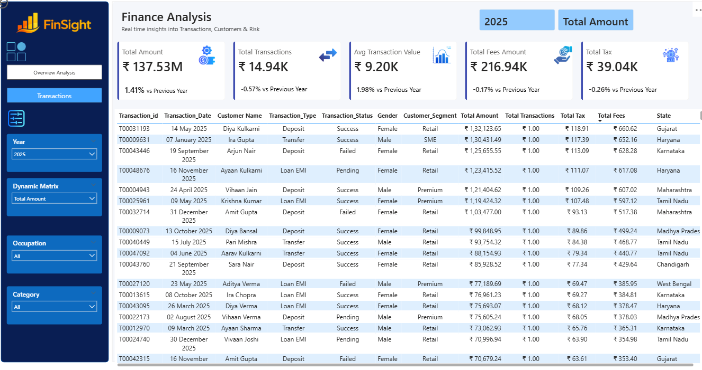
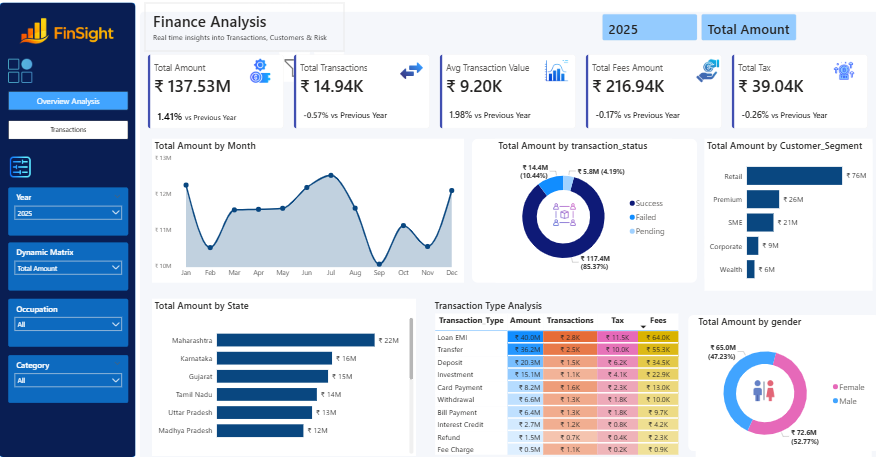

# Finance Transaction Analysis Dashboard

**Power BI | Data Analysis | Data Visualization | DAX**

## 📌 Project Overview

This project is a **practice project** created to strengthen my skills in **Microsoft Power BI, data analysis, dashboard development, and DAX**.

The project focuses on building an interactive **Finance Analytics Dashboard** to monitor and analyze financial transactions, customer behavior, fees, taxes, transaction performance, customer segments, and regional performance.

> **⚠️ Practice Project:**
> This project was developed by following a YouTube tutorial as part of my Power BI learning journey. The tutorial was used as a learning reference for understanding the project workflow, dashboard design, and analytical techniques. This repository is intended for educational and portfolio practice purposes.

---

## 🎯 Business Objective

The objective of the dashboard is to provide a centralized analytical solution for monitoring financial performance and identifying patterns across transactions, customers, business segments, and regions.

The business requirements focus on:

* Monitoring overall transaction growth and financial performance
* Analyzing monthly transaction trends
* Comparing successful, failed, and pending transactions
* Understanding customer segment contribution
* Comparing state-wise financial performance
* Analyzing transaction types
* Understanding gender-based customer participation
* Tracking Year-over-Year (YoY) performance changes
* Monitoring operational fees and taxes
* Supporting data-driven financial decision-making

---

## 📊 Key Performance Indicators

The dashboard includes the following main KPIs:

| KPI                           | Description                                                  |
| ----------------------------- | ------------------------------------------------------------ |
| **Total Amount**              | Total transaction amount processed, including YoY comparison |
| **Total Transactions**        | Total number of transactions performed                       |
| **Average Transaction Value** | Average amount per transaction                               |
| **Total Fees**                | Total fees collected from transactions                       |
| **Total Tax**                 | Total tax generated from transactions                        |

---

## 📈 Dashboard Analysis

### 1. Overview Analysis

The overview dashboard provides a high-level view of financial transaction performance.

It includes:

* Total Amount
* Total Transactions
* Average Transaction Value
* Total Fees
* Total Tax
* Monthly transaction amount trend
* Transaction status analysis
* Customer segment analysis
* State-wise financial performance
* Transaction type analysis
* Gender-based analysis

The business requirements specify analysis of monthly trends, transaction status, customer segments, states, transaction types, and gender.

### 2. Transactions

The second dashboard provides a more detailed view of the underlying transaction data, including a grid/detail view and drill-down capability.

---

## 🔍 Visualizations

### Monthly Transaction Trend

A line/area chart is used to analyze monthly transaction amounts and identify trends, spikes, or declines.

### Transaction Status

A donut chart compares transaction amounts across:

* Success
* Failed
* Pending

### Customer Segment

A horizontal bar chart compares transaction contribution across:

* Retail
* Premium
* SME
* Corporate
* Wealth

### State-wise Analysis

A horizontal bar chart compares transaction amounts across states to identify higher-performing regions.

### Transaction Type Analysis

A matrix/heatmap analyzes:

* Transaction Amount
* Fees
* Tax
* Transaction Count

across different transaction types such as deposits, transfers, investments, loan EMI, refunds, withdrawals, and payments.

### Gender Analysis

A donut chart compares transaction amount contribution between:

* Male
* Female

## These visualization requirements are based on the project's original business requirements.

## 🎛️ Interactive Filters

The dashboard allows users to dynamically filter the analysis using:

* Year
* Dynamic Measure
* Occupation
* Category

These filters were specified in the original project requirements.

---

## 🛠️ Tools & Technologies

* **Microsoft Power BI**
* **Power Query**
* **DAX**
* **Data Cleaning & Transformation**
* **Data Visualization**
* **Interactive Dashboard Design**
* **KPI Development**
* **Drill-down / Detailed Analysis**

---

## 📁 Repository Structure

```text
finance-transaction-analysis-powerbi/
│
├── Business Requirements/
│   └── Business_Requirements.docx
│
├── PowerBI/
│   └── Finance_Transaction_Analysis.pbix
│
├── dashboard/
│   ├── Overview_Analysis.png
│   └── Transactions.png
│
├── data/
│   ├── customers.csv
│   └── finance_transactions.csv
│
└── README.md
```

---

## 🖼️ Dashboard Preview

### Overview Analysis



### Transactions



---

## 📚 Skills Practiced

Through this project, I practiced:

* Building interactive Power BI dashboards
* Understanding business requirements
* Data transformation using Power Query
* Creating DAX measures
* Developing financial KPIs
* Creating interactive visualizations
* Using slicers and dynamic filters
* Analyzing customer segments
* Performing regional and transaction-level analysis
* Presenting business insights through data visualization
* Implementing drill-down/detail analysis

---

## 🎓 Learning Resource

This project was created as a **hands-on practice project while following a YouTube tutorial**.

The tutorial served as a learning reference for understanding the project structure, Power BI workflow, dashboard design, and analytical approach.

**YouTube Tutorial:**
*https://youtu.be/xVC9GyXergs?si=BkaYgfhI5ijKG25j*

---

## ⚠️ Disclaimer

This is a **practice/learning project** and is not an original client or commercial project.

The project was developed by following an existing YouTube tutorial for educational purposes. It is included in this repository to demonstrate my learning and practical experience with Power BI and data analytics.

---

## 👩‍💻 About This Project

This project is part of my ongoing learning journey in **Data Analytics and Business Intelligence**, with a focus on developing practical skills in Power BI, SQL, data visualization, and business-oriented analysis.

## 💡 Key Business Insights

Based on the 2025 Finance Analysis Dashboard:

* **Overall Performance:** The dashboard recorded **₹137.53M** in total transaction amount across approximately **14.94K transactions**, with an average transaction value of **₹9.20K**.

* **YoY Performance:** Total transaction amount increased by **1.41% YoY**, while transaction volume decreased slightly by **0.57%**. At the same time, average transaction value increased by **1.98%**, indicating higher average value per transaction.

* **Transaction Status:** **Successful transactions accounted for approximately 85.37% (₹117.4M)** of the total transaction amount, while failed and pending transactions represented approximately **10.44% (₹14.4M)** and **4.19% (₹5.8M)**, respectively.

* **Customer Segments:** The **Retail segment** generated the highest transaction amount at approximately **₹76M**, followed by Premium (**₹26M**) and SME (**₹21M**) customers.

* **Regional Performance:** **Maharashtra** recorded the highest transaction amount among the states displayed, at approximately **₹22M**, followed by Karnataka (**₹16M**) and Gujarat (**₹15M**).

* **Transaction Types:** **Loan EMI** generated the highest transaction amount at approximately **₹40.0M**, followed by **Transfer** at approximately **₹36.2M**. Deposit and Investment contributed approximately **₹20.3M** and **₹15.1M**, respectively.

* **Gender Analysis:** Male customers contributed approximately **₹72.6M (52.77%)**, while female customers contributed approximately **₹65.0M (47.23%)**, showing a relatively balanced distribution with a slightly higher contribution from male customers.

* **Monthly Trend:** Transaction amounts fluctuated throughout 2025, with relatively higher values visible around **January, June–July, and December**, while **September** recorded the lowest monthly transaction amount among the displayed months.

* **Fees & Tax:** The dashboard recorded **₹216.94K in total fees** and **₹39.04K in total tax**, providing visibility into additional financial components associated with transactions.

